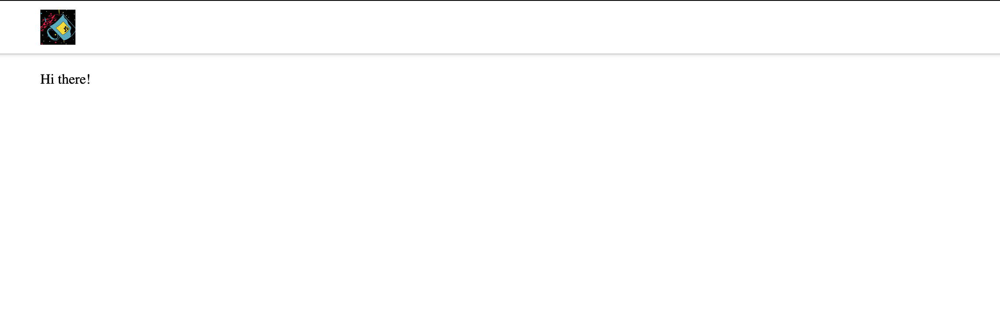
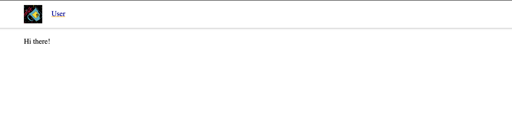

## Статический фронт

0. Запусти приложение. Оно поднимет сайт по адресу https://localhost:5001/ — вероятно, браузер будет ругаться на отсутствующие сертификаты. Разреши браузеру открыть страничку. Наш простейший сайт выглядит вот так:  

1. Найди, где находятся файлы, отображающие в браузере этот сайт.
2. Сейчас пока показывается только одна страница, но всего их четыре. Чтобы мочь переключаться между страницами, нужно добавить ссылки друг на друга. Добавь на каждую страницу ссылки на все остальные страницы. Предлагаю добавлять ссылки в «шапку», вот так:
  
   Как добавлять ссылку, смотри [тут](https://webref.ru/html/a)
3. Теперь можно ходить по страничкам! Мы воспользовались технологией гипертекст!
