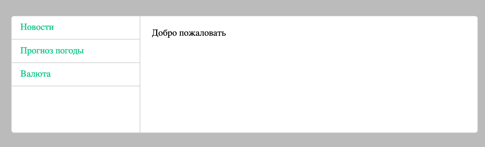

## Простое фронтенд-приложение

0. Перейди в терминале в директорию с этой задачей. Выполни команду `npm i` (она установит все зависимости). После этого выполни команду `npm start` — она запустит приложение по адресу http://localhost:8080/ Вот так оно выглядит:

1. Обсуди с группой, что делается в файлах:
    - `package.json`
    - `webpack.config.js`
    - `index.html`
    - `.babelrc`
    - `tsconfig.json`
    - `src/index.tsx`
2. Теперь, когда примерно понятно, как работает фронтенд-приложение, настало время что-нибудь в нем изменить. Добавь в колонку с навигацией еще один раздел с названием «Автоновости». При клике на эту ссылку должен случаться переход на выбранный тобой адрес. И по этому адресу должен быть написан какой-то контент (как на остальных страницах). Адрес и контент — на твое усмотрение.

